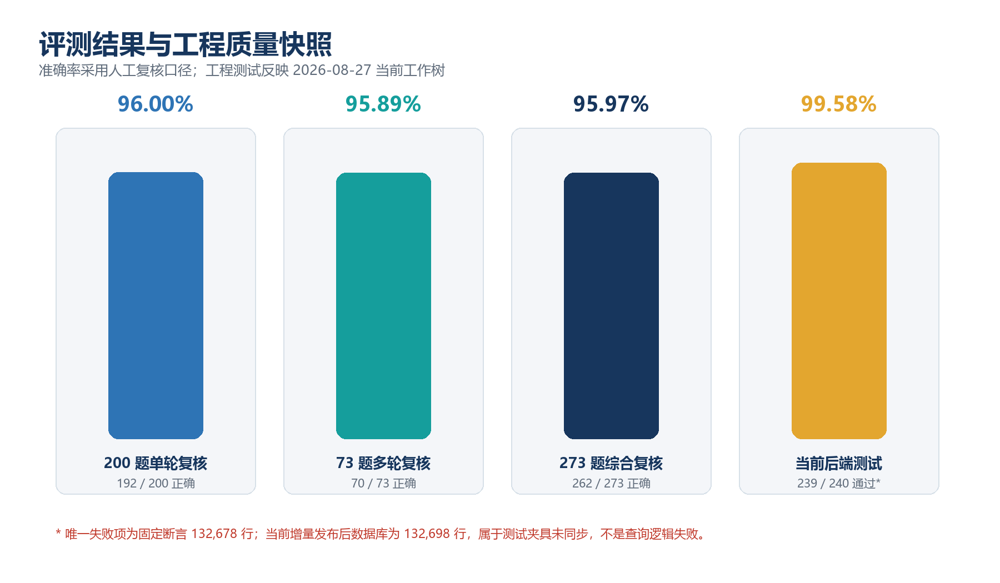
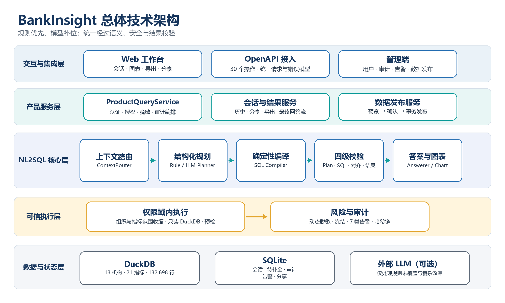
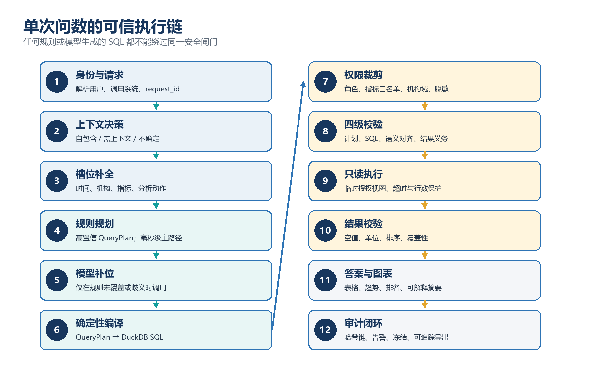
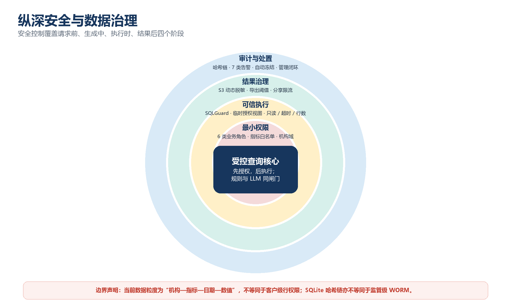
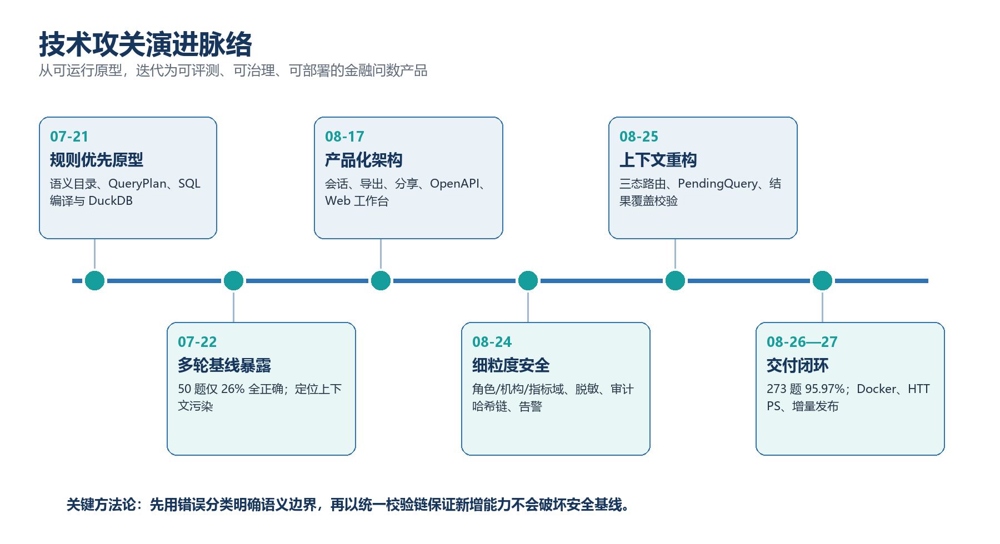

# BankInsight 金融指标智能问数系统技术文档

> 面向第五届研究生金融科技创新大赛的技术路线、系统架构、实验设计与成果量化  
> V1.0 · 证据快照 2026-08-27

## 执行摘要

BankInsight 是面向银行经营指标查询场景的垂直 NL2SQL 系统。它以金融语义目录和结构化 `QueryPlan` 为核心：高置信问题由规则规划器解析，复杂或未覆盖表达再由 LLM 补位；两条路径统一进入权限裁剪、SQL 安全、语义对齐和结果覆盖校验。

截至 2026-08-27，系统覆盖 **13 家机构、21 项指标、487 个日期、132,698 条指标事实**；提供 **29 条 API 路径、30 个 OpenAPI 操作和 6 类业务角色**。人工复核的 273 题综合集达到 **262 题正确、11 题不匹配、0 运行错误，准确率 95.97%**；规则主路径覆盖 269 题，占 **98.53%**。

> **证据口径**：当前状态以 2026-08-27 工作树为准。项目与同项目会话中未发现官方获奖名次或证书，因此本文只报告可验证技术成果，不虚构赛事排名。

## 1. 项目概述与问题定义

### 1.1 业务目标

比赛数据由银行机构、指标、日期和数值构成。用户问题表面上是自然语言转 SQL，实际同时包含金融术语识别、时间归一、组织范围、统计动作、排名方向、单位换算、衍生指标和权限边界。系统目标是让业务人员无需编写 SQL，即可完成点查、对比、排名、趋势、结构、环比/同比和勾稽分析，并获得表格、图表与自然语言结论。

### 1.2 核心挑战

| 挑战 | 技术含义 |
|---|---|
| 语义歧义 | “最高/最低”“全省/全行”“今年2月1日”等表达必须映射为可审计槽位。 |
| 多轮依赖 | 既要正确继承省略信息，又不能让上一轮状态污染当前问题。 |
| 精确计算 | 排名方向、比例单位、同比/环比、日均、勾稽需确定性执行。 |
| 金融安全 | 不同岗位只能查询授权机构与指标，结果、导出和分享必须一致脱敏。 |
| 工程交付 | 能力需通过 API、Web、容器、HTTPS、数据发布和运维审计真正可用。 |

### 1.3 设计原则

- 可信优先：任何 SQL 都必须经过统一校验与授权执行。
- 确定性优先：事实值和计算由规则、编译器与数据库完成，模型不口算。
- 渐进增强：以有限状态机解决当前问题，复杂度确有需要时再引入重型编排。
- 证据驱动：用人工复核、错误率、路由、延迟分位数、测试和部署量化成果。
- 边界清晰：容器化不等于国产化认证，哈希链不等于监管级 WORM。

## 2. 数据与金融语义底座

### 2.1 当前数据规模

| 维度 | 当前值 | 说明 |
|---|---:|---|
| 机构数 | 13 | 组织编码与名称双重识别 |
| 指标数 | 21 | 资产、负债、收入、风险、资本等主题 |
| 衍生规则 | 10 | 组合、排名、阈值、增速、勾稽等 |
| 指标事实 | 132,698 行 | 较历史基线增加 20 条增量记录 |
| 日期范围 | 2024-12-31—2026-06-30 | 487 个不同日期 |
| 主键 | 日期+机构+指标 | 当前重复主键为 0 |

数据层使用 DuckDB；增量更新采用“预览—冲突统计—覆盖确认—事务发布”。增量文件可以只含“指标数据表”并包含较少的已有指标，但不能通过文件新增指标定义。若使用未同步的原始 Excel 全量重建，可能覆盖增量数据，生产流程必须同步归档和源文件。

### 2.2 语义目录与口径优先级

`SemanticCatalog` 管理指标编码、别名、单位、方向属性、组织别名和派生规则。对“经营情况好/差”，系统按官方衍生说明：多数指标越高越好，ZB012、ZB013、ZB017 越低越好；13 家机构中 `RANK` 1—3 为好、4—9 中性、10—13 为差。

测试材料中第 91、93、151、152、191、192 题的参考答案与官方衍生规则冲突。当前实现坚持官方规则，并把此类问题标记为“口径冲突”，不为错误答案定向调参。

### 2.3 QueryPlan 可信中间表示

`QueryPlan` 把自然语言拆为指标集合、机构集合、时间范围、查询形态、排序方向、Top/Bottom N、阈值、聚合方式、单位和派生计算。支持点查、多指标、排名、省均、阈值、期间值、日均、求和、结构占比、同比/环比、勾稽、趋势和画像。

## 3. 总体技术路线

### 3.1 规则优先、模型补位

高频金融问数具有强结构性。系统优先用 `RulePlanner` 生成高置信 `QueryPlan`，再由 `SQLCompiler` 确定性生成 DuckDB SQL；规则未覆盖、表达歧义或复杂改写才进入 `LLMPlanner`。273 题中规则路径覆盖 269 题（98.53%），使整体中位延迟约 0.07 秒；少数 LLM 请求形成 20 秒级尾延迟。

### 3.2 全链路可信闸门

执行顺序为：身份与请求 → 上下文决策 → 槽位补全 → 规则/模型规划 → 确定性编译 → 权限裁剪 → 计划/SQL/语义校验 → 只读执行 → 结果/答案覆盖校验 → 图表与解释 → 审计闭环。任何来源的 SQL 都不能绕过同一闸门。

## 4. 模型架构与关键技术

### 4.1 三态上下文路由

`ContextRouter` 先判断问题为 `SELF_CONTAINED`、`CONTEXT_REQUIRED` 或 `UNCERTAIN`，再决定是否读取历史。当前显式槽位优先级最高，其次是 `PendingQuery`、最近成功上下文，最后才是 LLM 推断。该设计解决早期空槽位继承导致的日期、机构和指标污染。

### 4.2 PendingQuery 与持久化

缺机构、日期或指标时，失败请求不写入成功记忆，而是生成待补全状态。`PendingQuery` 按 `user_id+session_id` 写入 SQLite，后端重启后仍能续接。历史复测中，服务重启后补充“J市”，仍正确返回净利润 175.6 与 +25.34。

### 4.3 规则规划、LLM 规划与上下文最小化

规则覆盖点查、排名、阈值、期间、结构、同比/环比、勾稽、趋势和画像；日期解析支持“今年2月1日”“25年2月1日”，组织解析覆盖“全省/全行/全市/13个市”。LLM 只接收当前问题、必要成功历史、结构化槽位和必要结果摘要，不接收完整 SQL、完整日志或失败执行内容；输出必须转成 `QueryPlan` 并通过统一校验。

### 4.4 确定性编译与四级验证

- `PlanValidator`：检查槽位、查询形态、阈值、排名、时间和组织约束。
- `SQLGuard`：基于 sqlglot AST 仅允许只读 SQL，限制表、字段、函数和危险语句。
- `AlignmentValidator`：确保 SQL 与计划的指标、机构、日期、聚合和排序一致。
- `ResultValidator`：检查结果结构、空值、类型、排序和单位。
- `AnswerCoverageValidator`：保证排名、差值、比较、阈值、计数、勾稽等用户义务被完整回答。

确定性编译显式处理低值更优指标、Bottom N、比例单位、基期定位和窗口排名，避免模型把 0.0242% 放大为 2.42% 或 242%。

### 4.5 为什么当前未使用 LangGraph

当前流程是有限、可枚举的状态机，尚不需要多智能体、人工审批或复杂中断恢复。引入 LangGraph 会增加状态、调试和部署复杂度。后续出现人工审批、长任务恢复或多智能体协作时再评估。

## 5. 产品化、接口与前端

### 5.1 产品服务与会话

`ProductQueryService` 统一编排登录、会话、查询、结果、分享、导出、审计和告警。会话以 `user_id+session_id` 隔离；异步结果写回原始线程，防止用户切换线程后串线。SSE 第一条状态消息即携带 `session_id`，前端立即持久化，支持首轮澄清和断线续问。

Web 工作台包含会话列表、历史详情、流式回答、表格/图表、导出、分享和管理端。桌面端约 29:71 对话—报告布局，侧栏可在 240—480px 拖拽或折叠；报告独立滚动，输入框固定；移动端自适应为纵向布局。

### 5.2 OpenAPI 标准化

当前 OpenAPI 3.1 包含 **29 paths / 30 operations**，覆盖健康、认证、能力发现、同步/流式查询、最终回答、下钻、历史、导出、分享，以及管理端总览、指标、数据导入、审计、告警、冻结与用户管理。请求统一支持 `request_id` 与 `caller_system`，认证使用 HTTP Bearer，错误采用枚举错误码。旧版 `/query` 与 `/sessions` 仅作弃用兼容并返回 410。

接口面向数据中台、风控平台、营销平台、报表系统等复用；当前数据源适配器实现 DuckDB。抽象层为数据库替换提供接口，但不代表已完成国产 OS/CPU/数据库或国密认证。

## 6. 安全治理与部署

### 6.1 六类角色

| 角色 | 指标范围 | 机构范围 | 职责 |
|---|---|---|---|
| 总行管理 | 21 项 | 13 家 | 全景经营 |
| 分行管理 | 21 项 | 配置机构 | 本机构经营 |
| 业务条线 | ZB003—006、ZB018—021 | 配置机构 | 业务规模与效率 |
| 风险岗位 | ZB013—017 | 13 家 | 资产质量与风险 |
| 财务岗位 | ZB001—002、ZB007—012 | 13 家 | 财务、资本与盈利 |
| 管理员 | 无业务查询 | 无业务结果 | 用户、审计、告警、发布 |

授权在执行前完成，DuckDB 临时授权视图再次收缩数据域；`SQLGuard` 阻止绕过。当前“行级权限”准确含义是机构记录级，不是客户级。

### 6.2 脱敏、审计和七类告警

ZB013—017 等 S3 指标按角色动态脱敏，页面、回答、导出和分享使用同一清洗策略。审计事件通过 `previous_hash + event_hash` 的 SHA-256 链检测篡改、链断和尾删，但 SQLite 不是监管级 WORM。

七类告警包括：S3 高频访问；10 分钟 3 次越权后冻结 15 分钟；单次导出超过 200 行；单日超过 1,000 行；非工作时段导出 S3；10 分钟 3 次分享；单查询超过 8 个指标。

### 6.3 容器与 HTTPS

Docker Compose 一键启动后端、前端和 Caddy；数据挂载到宿主机 `deploy-data`。容器内路径统一为 `/app/source/dataset.xlsx`、`/app/data/bank_metrics.duckdb`、`/app/data/product.sqlite3`。历史公网验证中，首页、`/health`、`/docs`、`/openapi.json` 均返回 200，HTTP 308 跳转 HTTPS，TLS 1.3 可用。

> **供应链风险**：历史 `npm audit` 有 21 项告警（1 低、4 中、16 高），正式上线前需要依赖升级、镜像扫描和完整回归。

## 7. 实验设计与量化结果

### 7.1 实验设计

| 实验集 | 规模 | 目标 | 评价方式 |
|---|---:|---|---|
| 单轮 | 200 | 金融语义、计算、排序、单位 | 人工复核答案值与覆盖 |
| 多轮 | 73 | 指代、省略、补全、跨轮状态 | 按会话顺序执行并人工复核 |
| 综合 | 273 | 统一效果、路由和时延 | `verdict + route + elapsed` |
| 上下文回归 | 50 | 历史缺陷完成性与错误率 | 不作为最终语义准确率 |
| 工程测试 | 240 后端 + 前端 | 回归与交付质量 | pytest、build、lint、test |

主要指标为人工复核准确率、运行错误率、规则/LLM 路由占比、总耗时、平均/中位/P95/最大延迟、上下文完成率和工程测试结果。

### 7.2 核心结果

| 实验 | 正确/不匹配/错误 | 准确率 | 路由 | 延迟 |
|---|---|---:|---|---|
| 200 题首轮 | 189 / 10 / 1 | 94.50% | 196 规则 / 3 LLM / 1 错误 | P95 0.08s |
| 200 题第二轮 | 192 / 8 / 0 | 96.00% | 199 规则 / 1 LLM | P95 0.09s |
| 73 题多轮 | 70 / 3 / 0 | 95.89% | 70 规则 / 3 LLM | 综合报告子集 |
| 273 题综合第二轮 | 262 / 11 / 0 | **95.97%** | 269 规则 / 4 LLM | **P95 0.11s** |
| 273 题综合第三轮 | 261 / 12 / 0 | 95.60% | 269 规则 / 4 LLM | P95 0.10s |

第二轮综合报告总耗时 105.74 秒，平均 0.387 秒，中位数 0.07 秒，P95 0.11 秒，最大 20.03 秒。规则路径承担 98.53% 请求；4 个 LLM 请求解释了尾延迟。

### 7.3 多轮演进

早期 50 题仅 13 题完全正确（26%）、9 题核心正确（18%）、22 题实质错误（44%）、6 题运行错误（12%）。重构后同类回归集 50/50 完成、0 SQL/解析/执行错误，总耗时 44.27 秒、中位 0.035 秒、P95 3.751 秒、最大 19.226 秒，约 4 次使用 LLM。

“50/50 完成”不等于语义准确率；该历史集曾存在比例展示错误，后续已修复。最终多轮准确率以 73 题人工复核的 95.89% 为准。

### 7.4 当前工程验证

| 验证项 | 结果 | 说明 |
|---|---|---|
| 后端 pytest | 239 / 240 通过，14.14s | 失败项固定期望 132,678 行；当前实际 132,698 行 |
| 前端构建 | 通过 | vinext 构建成功 |
| 前端 lint | 通过 | 无失败 |
| 前端测试 | 2 / 2 通过 | 日期特性回归通过 |
| 容器部署（历史） | 3 服务健康 | 首页、健康、API 文档、OpenAPI 可达 |
| 端到端（历史） | 通过 | A 市存款查询返回 42.02 |

后端按用例数通过率为 99.58%。唯一失败是测试夹具未适应 20 条增量数据，不是 NL2SQL 查询逻辑失败，但应尽快移除总行数硬编码并在数据发布后自动回归。

## 8. 技术攻关脉络

1. **确定性骨架**：完成语义目录、QueryPlan、规则规划、SQL 编译和 DuckDB 执行。
2. **多轮重构**：用 50 题失败分类推动三态路由、PendingQuery、成功/失败记忆隔离。
3. **产品与安全**：补齐登录、会话、流式回答、导出、分享、OpenAPI、角色数据域、脱敏、审计、告警和冻结。
4. **评测收敛**：通过 200/273 题人工复核修复排名方向、省级口径、日期、比例和勾稽覆盖，并建立真值优先级。
5. **部署与更新**：形成 Docker+Caddy+HTTPS+持久卷，并把数据维护从全量重建扩展为增量事务发布。

## 9. 参赛成果、创新点与边界

### 9.1 可验证成果

- 算法：273 题人工复核 95.97%，0 运行错误；73 题多轮 95.89%。
- 效率：规则路径 98.53%；综合中位 0.07 秒，P95 0.11 秒。
- 数据：13 机构、21 指标、487 日期、132,698 行，支持增量事务发布。
- 安全：6 类角色、指标/机构域、动态脱敏、哈希链、7 类告警。
- 集成：OpenAPI 3.1，29 路径、30 操作；支持同步、流式和管理接口。
- 交付：Web 工作台、Docker Compose、Caddy HTTPS、持久化和健康检查。

### 9.2 创新点

- **结构化可信中间层**：QueryPlan 连接语言、权限与 SQL。
- **双路规划、单一闸门**：规则与 LLM 分工但共用安全和校验。
- **多轮状态正交化**：上下文依赖与规则覆盖解耦，PendingQuery 持久化。
- **答案覆盖校验**：从 SQL 可执行提升到用户义务完整回答。
- **语义—安全一体化**：同一指标目录驱动别名、方向、单位、白名单和脱敏。
- **数据持续交付**：预览、冲突统计、覆盖确认和事务发布形成数据闭环。

### 9.3 边界与风险

- 内部人工复核尚未由赛事方或第三方独立复现。
- DuckDB 与 SQLite 是单机架构，不具备生产级高可用、灾备和 WORM。
- 当前是机构记录级权限，不是客户级权限。
- 未完成国产 OS/CPU/数据库与国密环境认证。
- LLM 路径存在 16—20 秒级尾延迟。
- 前端依赖存在历史高危告警。
- 当前一个后端测试因固定行数断言失败。

### 9.4 下一阶段

1. 修复数据行数硬编码测试，固化 273 题逐题金标和冲突清单。
2. 升级前端依赖，增加 SBOM、secret 和镜像漏洞扫描。
3. 建设指标口径、同义词、已验证样例检索和表字段召回；借鉴 SQLBot 元数据治理思想，但不复制受限代码。
4. 为 LLM 增加超时、熔断、缓存、离线重放与模型版本对比。
5. 把审计链写入对象锁定或专用审计存储，补充备份恢复演练。
6. 增加 PostgreSQL/国产数据库适配器和目标环境兼容认证。
7. 只有业务出现人工审批、长任务恢复或多智能体协作时再评估 LangGraph。

## 10. 结论

BankInsight 通过“语义目录—QueryPlan—确定性编译—统一可信闸门—产品交付”，把 NL2SQL 从模型演示提升为面向金融指标的可解释、可治理系统。273 题人工复核 95.97%、规则路径 98.53%、0 运行错误，以及 132,698 行数据、30 个 API 操作、6 类角色和容器化部署，共同构成可验证的参赛技术成果。

## 附录 A：核心模块索引

| 模块 | 职责 |
|---|---|
| `text2sql/service.py` | NL2SQL 主编排、规则/LLM 尝试与可信执行 |
| `text2sql/context_router.py` | 三态上下文依赖判断 |
| `text2sql/rule_planner.py` | 高频金融问题规则规划 |
| `text2sql/llm_planner.py` | LLM 结构化规划与降级 |
| `text2sql/sql_compiler.py` | QueryPlan 到 DuckDB SQL |
| `text2sql/validators.py` | 计划、SQL、语义、结果和答案覆盖校验 |
| `text2sql/executor.py` | 授权域内只读执行 |
| `text2sql/semantic_catalog.py` | 指标、组织、单位、方向和衍生规则 |
| `text2sql/product_service.py` | 产品、安全与审计编排 |
| `text2sql/product_store.py` | 会话、PendingQuery、审计、告警与冻结 |
| `text2sql/metric_data_import.py` | 增量预览与事务发布 |
| `text2sql/api.py` | FastAPI/OpenAPI 与 SSE 接口 |

## 附录 B：复现建议

1. 固定 Git 提交、配置、数据库 `build_metadata`、模型供应商和模型版本。
2. 按顺序执行 200 题单轮与 73 题多轮，保留会话边界。
3. 保存问题、会话、路由、QueryPlan、SQL 摘要、耗时、结果、判定和说明。
4. 自动汇总准确率、错误率、路由占比、平均/中位/P95/P99/最大延迟及逐题差异。
5. 在数据发布、规则修改、模型升级和权限变更后运行后端、前端与 273 题回归。
6. 在部署环境验证健康、登录、问数、流式回答、导出、分享、审计、告警和恢复流程。
